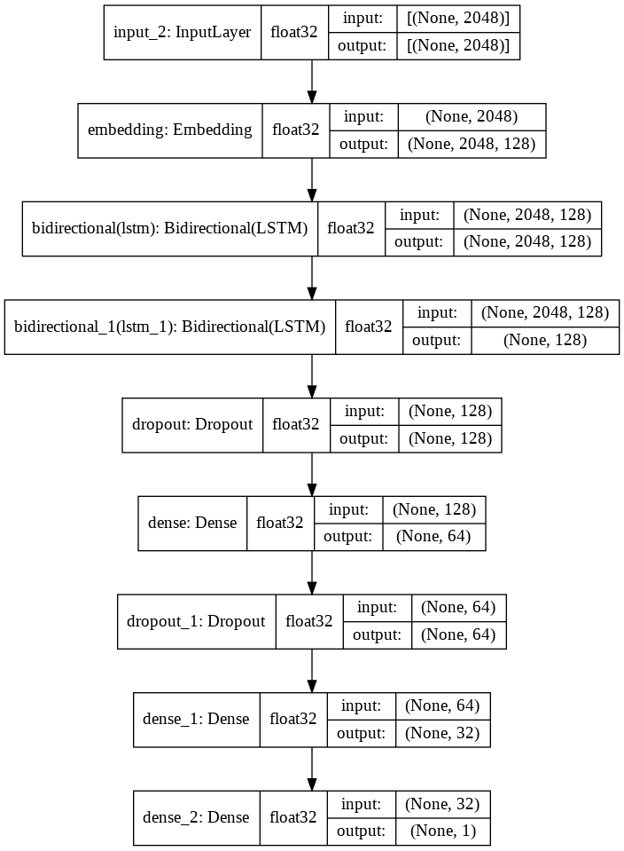
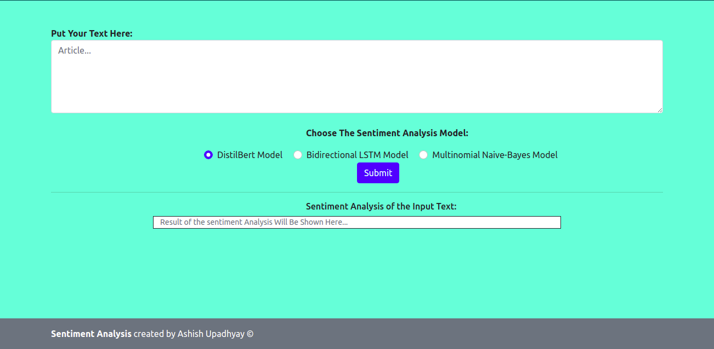
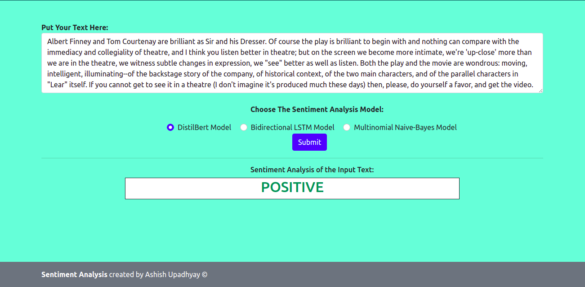

# Sentiment Analysis

Sentiment analysis is the use of natural language processing, text analysis, computational linguistics, and biometrics to systematically identify, extract, quantify, and study affective states and subjective information.

So, In this project, I created a sentiment analysis model which is trained on the **Stanford Movie Dataset** [Dataset](https://ai.stanford.edu/~amaas/data/sentiment/). Then I split the data into *train* and *test* further and the *training data* contains approx 37500 text files and *testing data* contains the 10000 text files of sentiment reviews of movies.

There are 3 different kind of models which is used for this project:

#### 1. DistilBERT
The **DistilBERT** model is based on the **BERT** model but has less parameter & accuracy than the original model but **DistilBERT** model does replicate the original model weel and is much faster than **BERT** as this model contains approx 6 times less parameter than the original.
You can find this model and how to code this model in [Huggingface website](https://huggingface.co/transformers/quicktour.html). I also used same module/library to use this model.

#### 2. LSTM
The **LSTM** model is advanced version of **RNN** in a way. It remember the long sequence better than the **RNN** model/unit. Generally, **LSTM** is used when you have long sentance in your trainig and testing dataset. It remembers the semantic meaning of the text data/sequence data pretty well. That is why I used **LSTM** model for this project.

The model's architecture is as follows:

LSTM model's ***training accuracy*** is `91%` and the ***testing accuracy*** is `87%`.

#### 3. Naive Bayes
Naive bayes model is based on the probability of the n-gram(n can be any number) words present in the sentence. It is generally a project in which, the model/algorithm calculate the sentiment analysis probability based on the words in a sentence. The words can be splitted into number of n-grams and the sentiment of a sentence is calculated.

Naive bayes model's accuracy is 51.07%.

### WEBAPP :--
These three models were deployed with flask and the flask site looks like the following:

You can put the text in the *textarea* and the result of the sentiment will be shown like the following:

##### THE END
